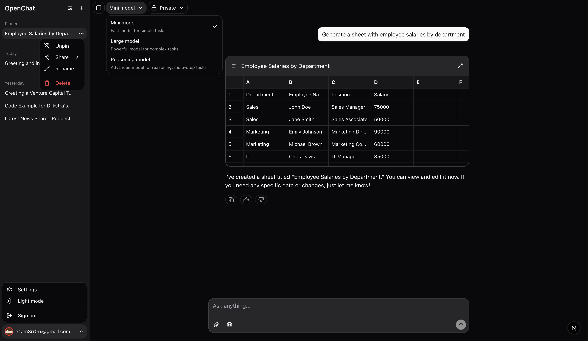

<a href="https://openchat-beta.vercel.app">
  
  <h1 align="center">OpenChat</h1>
</a>

<p align="center">
  An Open-source AI Chatbot Built With Next.js, Convex, and AI SDK.
</p>

<p align="center">
  <a href="#features"><strong>Features</strong></a> ·
  <a href="#model-providers"><strong>Model Providers</strong></a> ·
  <a href="#deploy-your-own"><strong>Deploy Your Own</strong></a> ·
  <a href="#running-locally"><strong>Running locally</strong></a>
</p>
<br/>

## Features

- [Next.js](https://nextjs.org) App Router
  - Advanced routing for seamless navigation and performance
  - React Server Components (RSCs) for server-side rendering and increased performance
- [AI SDK](https://sdk.vercel.ai/docs)
  - Unified API for generating text, structured objects, and tool calls with LLMs
  - Hooks for building dynamic chat and generative user interfaces
  - Assisting with code generation, images, text editing, handling data, and searching the web
- [Shadcn/ui](https://ui.shadcn.com)
  - Styling with [Tailwind CSS](https://tailwindcss.com)
  - Component primitives from [Radix UI](https://radix-ui.com) for accessibility and flexibility
- Data Persistence
  - [Convex](https://www.convex.dev/) for saving chat history and user data
  - [Convex file storage](https://docs.convex.dev/file-storage) for efficient file storage
- [Convex Auth](https://labs.convex.dev/auth)
  - Simple and secure authentication

## Model Providers

This app ships with [Openai](https://openai.com/) provider as the default. However, with the [AI SDK](https://sdk.vercel.ai/docs), you can switch LLM providers to [Ollama](https://ollama.com), [Anthropic](https://anthropic.com), [Cohere](https://cohere.com/), and [many more](https://sdk.vercel.ai/providers/ai-sdk-providers) with just a few lines of code.

- Mini model (`gpt-4o-mini`): A fast and efficient model suitable for simple tasks
- Large model (`gpt-4o`): A powerful model designed for complex tasks
- Reasoning model (`o4-mini`): An advanced model configured for multi-step reasoning tasks

## Deploy Your Own

You can deploy your own version of the OpenChat to Vercel with one click:

[](https://vercel.com/new/clone?repository-url=https%3A%2F%2Fgithub.com%2Fmuradpm%2Fopenchat&env=CONVEX_DEPLOY_KEY,OPENAI_API_KEY&envDescription=Learn%20more%20about%20how%20to%20get%20the%20API%20Keys%20for%20the%20application&envLink=https%3A%2F%2Fgithub.com%2Fmuradpm%2Fopenchat%2Fblob%2Fmain%2F.env.example&demo-title=OpenChat&demo-description=An%20open-source%20AI%20chatbot%20built%20with%20Next.js%2015%2C%20Convex%2C%20and%20AI%20SDK.&demo-url=https%3A%2F%2Fopenchat-beta.vercel.app)

## Running locally

You will need to use the environment variables [defined in `.env.example`](.env.example) to run OpenChat. It's recommended you use [Vercel Environment Variables](https://vercel.com/docs/projects/environment-variables) for this, but a `.env` file is all that is necessary.

> Note: You should not commit your `.env` file or it will expose secrets that will allow others to control access to your various OpenAI and authentication provider accounts.

1. Install Vercel CLI: `npm i -g vercel`
2. Link local instance with Vercel and GitHub accounts (creates `.vercel` directory): `vercel link`
3. Download your environment variables: `vercel env pull`

```bash
bun install
bun dev
```

Your app should now be running on [localhost:3000](http://localhost:3000/).
